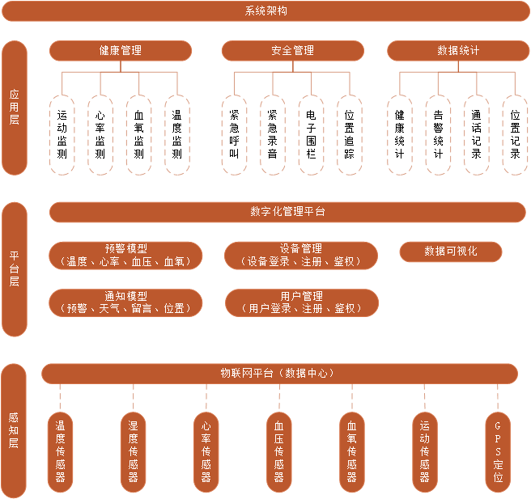
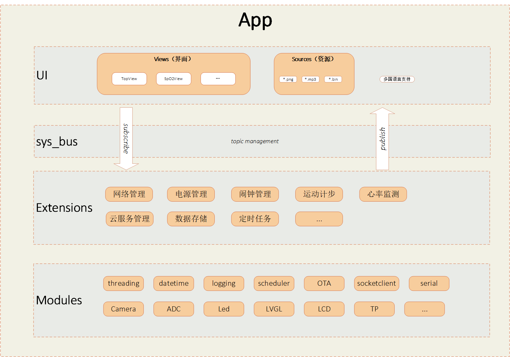
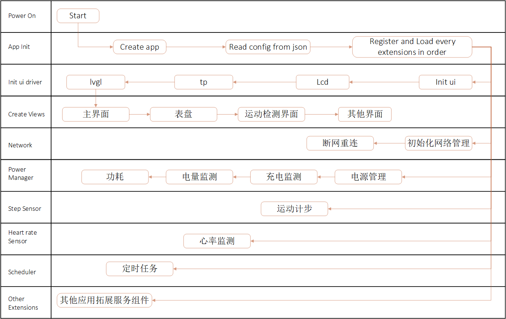
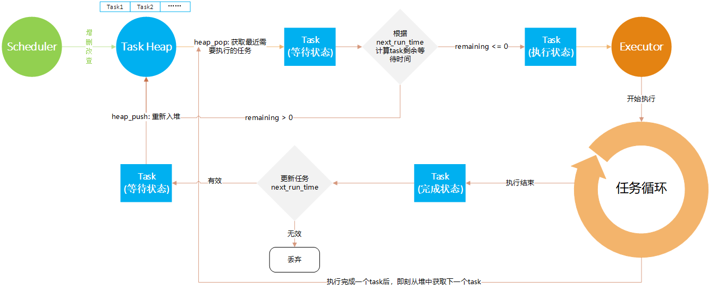

移远+迦沃智能手表项目简介

## 简介

基于移远4G模组研发的智能手表，通过硬件设备进行实时数据采集、数据监测，依托于数据管理平台实现数据存储、计算、分析、统计，为用户安全、健康管理提供平台和数据支撑，并建立安全主动预警、告警系统，及时处理或防范安全风险，如心率异常、血压异常、摔倒、恶劣天气、溺水、集体性疫情等，有效防范用户的安全、健康风险，为用户的生命健康提供强有力的保障。

## 功能列表

### 手表（设备端）

| 功能         | 描述                                                         | 备注 |
| ------------ | ------------------------------------------------------------ | ---- |
| 智能闹钟     |                                                              |      |
| 语音通话     |                                                              |      |
| 多国语言设置 | 屏幕显示文本支持多语言切换                                   |      |
| 表盘切换     | 方案一：长按屏幕切换需tp支持长按触发 —— 暂不支持  方案二：增加实体按键切换 |      |
| 计步功能     | 加速度传感器，算法实现                                       |      |
| 睡眠监测     | 算法实现                                                     |      |
| 心率监测     |                                                              |      |
| 血氧监测     |                                                              |      |
| 温度监测     |                                                              |      |
| 音乐控制     |                                                              |      |
| 短信提醒     |                                                              |      |
| GPS定位      |                                                              |      |
| 远程升级     |                                                              |      |
| 手电筒       | 方案一：通过白屏+ 屏幕亮度调节最大实现 方案二：通过打开摄像头补光灯常亮实现 |      |
| 电量检测     |                                                              |      |
| 抬腕亮屏     |                                                              |      |
| 秒表计时     |                                                              |      |
| 屏幕亮度调节 |                                                              |      |
| 恢复出厂设置 |                                                              |      |
| 修改时间制式 |                                                              |      |
| 查找手机     | 通过云平台下发指令，手机响应方式实现查找                     |      |
| 多模式切换   | 响铃模式、静音模式、睡眠模式、勿扰模式、省电模式等           |      |
| 音乐播放     | 本地播放、云端播放                                           |      |
| 亲情号码     | 亲情号码增删改查 亲情号码一键拨打                         |      |
| 紧急呼叫     | 110、119……                                                   |      |
| 紧急联系人   | 告警事件发短信或拨打电话给紧急联系人                         |      |
| 导航         | 高德 百度                                                |      |
| 支付         | 支付宝 微信                                              |      |
| wifi         | 连接手机端                                                   |      |
| 蓝牙         | 连接手机端                                                   |      |
| 日历         |                                                              |      |
| 备忘录       |                                                              |      |
| 天气         |                                                              |      |
| 新闻提醒     |                                                              |      |
| 邮件提醒     |                                                              |      |
| 拍照         |                                                              |      |
| 电子围栏     | 作用于安全告警如疫情场所、自然灾害地、用户自定义区域等。     |      |
### 云端（平台端）

| 功能             | 描述                                                         | 备注 |
| ---------------- | ------------------------------------------------------------ | ---- |
| 用户注册         | 账户 + 密码                                                  |      |
| 设备注册         | 手表设备与平台账户绑定，每台手表有唯一id值（可以定义为imei） |      |
| 设备鉴权         | 当设备侧在平台注册后，设备侧可以登录云平台                   |      |
| 云平台指令控制   | 位置查询 位置追踪 录音 响铃 亮屏 设备固件升级 参数配置（如围栏参数） |      |
| 监测数据上报     | 设备侧定时上行设备监测数据（心率、血氧、血压、步数等）       |      |
| 事件上报         | 如摔倒、心率过高、血氧过低等告警事件                         |      |
| 告警事件推送     | 平台实时推送告警数据到注册手机                               |      |
| 健康数据展示     | web页面中展示设备采集的步数、心率、血氧等数据                |      |
| 运动轨迹回放     | 运动轨迹回放                                                 |      |
| 用户配置远程备份 | 备份设备侧的用户配置                                         |      |
| 用户配置远程恢复 | 恢复设备侧的用户配置                                         |      |
| 音频推流         | 云音乐播放 本地播放 下载本地                         |      |
| 视频推流         | 视频播放                                                     |      |
| 新闻推送         |                                                              |      |
| 天气推送         |                                                              |      |

### 系统架构

## 手表软件架构

### 系统模块

- App：应用程序单例，全局唯一。
- UI：基于LVGL+LCD+TP的用户图形层接口。
- sys_bus：基于主题的消息订阅发布中间层，用于应用底层服务与UI层交互。
- Extensions：拓展服务组件，以业务划分的不同功能的实现模块。单例App可以注册多个拓展服务组件，各服务组件之间可以通过App对象互相访问。
- Modules：QuecPython相关接口层，包括系统线程管理、日志、升级、socket等。

### 应用代码启动流程

### 任务调度

本方案是一个基于QuecPython实现的定时任务框架（单线程 + 小顶堆）。提供了，基于日期（固定某一时刻）、固定时间间隔，以及周期（目前仅支持每天HH:MM时刻执行）类型执行的任务。

- **Scheduler**：调度器，用户接口，对任务的增删改查。
- **Task Heap**：任务存储（小顶堆实现），按照任务剩余等待时间排序，堆顶为最近需要被调度的任务。
- **Task**：任务，即为作业执行单元；每个任务绑定一个`Trigger`（触发器）。
- **Trigger**：任务触发器，负责更新任务的下一次执行时间点（`next_run_time`），以及计算剩余等待时间（`remaining`，单位秒）。
- **Executor**：执行器，负责执行从Task Heap中取出的任务。